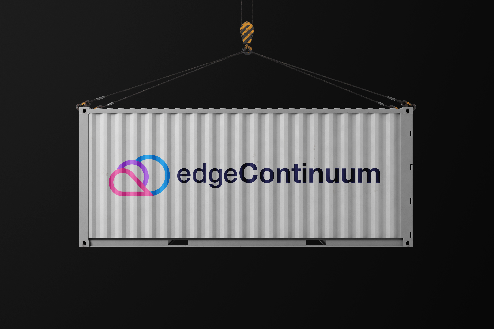

# The Next-Gen Hyperconverged Edge Computing Platform for Telecom Operators

## About us

At edgeContinuum, we're building the future of edge computing for Telecom Operators. Our platform is focused on scalability, hypervisor-agnostic infrastructure, and converged solutions that prioritize flexibility and efficiency. We provide standardized interfaces to integrate with 3GPP 5G networks and expose GSMA Camara EdgeCloud APIs, ensuring full compatibility with a broad range of virtualization technologies, including virtual machines, containers, and more.

This platfom was made possible thanks to the broad research and developments carried out at the University of Vigo, and the financial support from the Government of Galicia.

Find out more about us on our [website](https://edgecontinuum.com) or [LinkedIn](https://www.linkedin.com/company/edgecontinuum).
