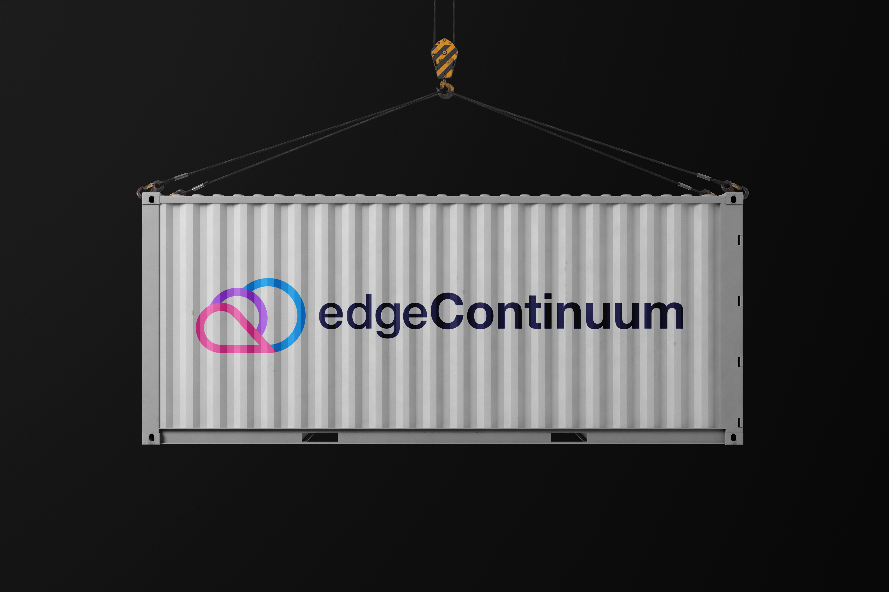

# edgeContinuum — The Public Cloud Experience, On Your Own Infrastructure

**edgeContinuum** is a sovereign cloud platform that brings the public cloud experience to infrastructure you control. Offer **managed Kubernetes, managed databases, and virtual machines** to your clients, or give your teams cloud-like self-service on your own hardware — **one platform, one API**, anywhere you run OpenStack.

[**Website**](https://edgecontinuum.com) · [**Product**](https://edgecontinuum.com/product) · [**Console**](https://console.edgecontinuum.com) · [**Docs**](https://docs.edgecontinuum.com) · [**LinkedIn**](https://www.linkedin.com/company/edgecontinuum)

---

## What is edgeContinuum?

edgeContinuum is a **private cloud and edge-cloud management platform** — a self-hosted, OpenStack-native alternative to public cloud and VMware. It unifies your **on-premises, edge, and private cloud** infrastructure under a single control plane, delivering managed services and self-service provisioning without your data ever leaving your perimeter.

Built for **data sovereignty**, it runs from fully-managed SaaS to completely **air-gapped** deployments, with each region **autonomous by design** — regions keep running during connectivity loss.

## Managed Services & Features

- **Managed Kubernetes** — CNCF-conformant clusters with autoscaling, in-place upgrades, and self-healing. Download a kubeconfig and use `kubectl` in seconds.
- **Managed PostgreSQL (DBaaS)** — provisioning, high availability, and full lifecycle handled, with per-project isolation.
- **Virtual Machines** — VMs, networking, routers, and firewall rules on hardware that never leaves your perimeter.
- **App Marketplace** — one-click deployment of Helm charts and containers.
- **Multi-tenancy** — organizations, projects, and role-based access with quotas and usage tracking per client.
- **Autonomous regions** — manage multiple infrastructures with link-loss tolerance for distributed and edge deployments.
- **AI assistant** — natural-language resource queries and log analysis.
- **Automation everywhere** — Web console, REST API, and Terraform provider.

## Why edgeContinuum?

- **Sovereignty** — your hardware, your data, your perimeter.
- **Cloud-like self-service** — provision managed Kubernetes, databases, and VMs on demand.
- **Operational automation** — self-healing, automated upgrades, zero configuration drift.
- **Flexible deployment** — from SaaS to fully air-gapped, on any OpenStack.
- **Unified management** — one console and one API across every managed service.

## Who is it for?

- **Enterprise IT & platform teams** building an internal, cloud-like self-service platform.
- **MSPs, telcos, and service providers** offering managed Kubernetes, DBaaS, and VMs to customers.
- **Regulated & sovereign organizations** needing on-premises or air-gapped infrastructure.

## Use Cases

Private cloud platform · VMware alternative · OpenStack management · sovereign cloud · edge computing · managed Kubernetes for service providers · Database-as-a-Service on-premises.

---

### Get started

🚀 **For Operations Teams** — accelerate time-to-value by provisioning managed Kubernetes, DBaaS, and VMs on demand.

💻 **For Development Teams** — automate the full application lifecycle for faster, more reliable deployments.

[**See the product →**](https://edgecontinuum.com/product) · [**Request a free trial →**](https://edgecontinuum.com) · [**Book a call →**](https://edgecontinuum.com)
